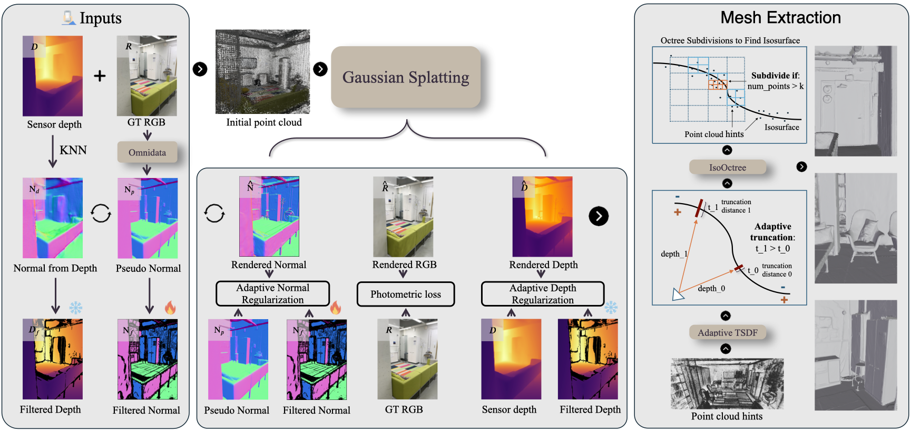

# DN-Splatter + AGS-Mesh
This repo implements research papers ([DN-Splatter](https://maturk.github.io/dn-splatter/) and [AGS-Mesh](https://xuqianren.github.io/ags_mesh_website/)) for depth and normal supervision of Gaussian splatting models for improved novel-view synthesis using smartphone data (iPhones) and mesh reconstruction.

### Pipelines:
<p align="center">
    <figure style="display: inline-block; text-align: center; margin: 10px;">
        
        <figcaption>DN-Splatter</figcaption>
    </figure>
    <figure style="display: inline-block; text-align: center; margin: 10px;">
        
        <figcaption>AGS-Mesh</figcaption>
    </figure>
</p>

Quick demo:

https://github.com/maturk/dn-splatter/assets/30566358/9b3ffe9d-5fe9-4b8c-8426-d578bf877a35
<!-- CONTENTS -->
<details open="open" style='padding: 10px; border-radius:5px 30px 30px 5px; border-style: solid; border-width: 1px;'>
  <summary>Table of Contents</summary>
  <ol>
    <li>
      <a href="#installation">Installation</a>
    </li>
    <li>
      <a href="#usage">Usage</a>
    </li>
     <li>
      <a href="#mesh">Mesh Extraction</a>
    </li>
    <li>
      <a href="#scripts">Scripts</a>
    </li>
    <li>
      <a href="#datasets">Custom Datasets</a>
    </li>
    <li>
      <a href="#datasets">Datasets</a>
    </li>
    <li>
      <a href="#evaluation">Evaluation</a>
    </li>
    <li>
      <a href="#acknowledgements">Acknowledgements</a>
    </li>
    <li>
      <a href="#citation">Citation</a>
    </li>
    <li>
      <a href="#developers">Developers</a>
    </li>
  </ol>
</details>

## Updates
- 29.11.2024: We release [AGS-Mesh](https://xuqianren.github.io/ags_mesh_website/) which improves mesh reconstruction using a novel depth and normal filtering strategy, and octree-based isosurface extraction method. We release code for Splatfacto based AGS-Mesh model and 2DGS based AGS-Mesh model. We release AGS-Mesh plug in code for both DN-Splatter and Inria 2DGS version. Please switch to [AGS-Mesh-2dgs](https://github.com/maturk/dn-splatter/tree/ags-mesh-2dgs) for Inria 2DGS version.
- 17.10.2024: [FusionSense](https://github.com/ai4ce/FusionSense) improves DN-Splatter in sparse settings for robotic tactile applications! 🚀
- 04.09.2024: Support Open3d TSDF to extract mesh, support Patch-based Depth Correlation Loss from [SparseGS](https://github.com/ForMyCat/SparseGS) for monodepth supervision, support visualizing normal estimates from the Gaussian geometry and estimated surface normal from depths, support colmap SFM point cloud initialization for MuSHRoom dataset.
- 14.06.2024: Support gsplat [v1.0.0 🚀](https://x.com/ruilong_li/status/1799156694527909895). Faster training and better memory consumption. Training with `--pipeline.model.predict_normals` is about 20% slower than without.
- 16.04.2024: Support for [DSINE](https://github.com/baegwangbin/DSINE) monocular normal supervision.
- 20.04.2024: `dn-splatter-big`: a variant featuring less aggressive Gaussian culling threshold, which leads to an increased number of Gaussians in the optimized scene.  On certain datasets, this can lead to better novel-view synthesis results.
## Installation
<details close>
<summary> Method 1. Using Conda and Pip</summary>
    Follow installation instructions for [Nerfstudio](https://docs.nerf.studio/quickstart/installation.html). This repo is compatible with a `nerfstudio` conda environment.

    Clone and install DN-Splatter
    ```bash
    conda activate nerfstudio
    git clone https://github.com/maturk/dn-splatter
    cd dn_splatter/
    pip install setuptools==69.5.1
    pip install -e .
    ```
</details>

<details close>
<summary> Method 2. Using Pixi </summary>
Download the [pixi package manager](https://pixi.sh/latest/), this will manage the installation of cuda/pytorch/nerfstudio for you

Clone and install DN-Splatter
```bash
git clone https://github.com/maturk/dn-splatter
cd dn_splatter/
pixi install
```

To run an example
```bash
pixi run example
```

To activate conda enviroment
```bash
pixi shell
```
</details>
 
## Data Preparation Scripts

<details close>
<summary> Generate pseudo ground truth normal maps </summary>
The `dn-splatter` model's predicted normals can be supervised with the gradient of rendered depth maps or by external monocular normal estimates using the flag `--pipeline.model.normal-supervision (mono/depth)`. To train with monocular normals, you need to use an external network to predict them.

We support generating low and hd monocular normal estimates from a pretrained [omnimodel](https://github.com/EPFL-VILAB/omnidata) and from [DSINE](https://github.com/baegwangbin/DSINE). 


#### 1. Omnidata normals:
You need to download the model weights first:

```bash
python dn_splatter/data/download_scripts/download_omnidata.py
```

Then generate normal maps using the following command:
```bash
python dn_splatter/scripts/normals_from_pretrain.py
        --data-dir (path to data root which either has a transforms.json or images/ folder)
        --img-dir-name (if transforms.json file is not found, use images in this folder (default /images))
        --resolution {low, hd} (low default and reccommended)
```
We highly reccommend using low res normal maps, since generating HD versions from omnidata (that match the dataset image size) is very time consuming.

#### 2. DSINE normals:
To generate normals from DSINE, run the following command:

```bash
python dn_splatter/scripts/normals_from_pretrain.py --data-dir [PATH_TO_DATA] --model-type dsine
```

If using DSINE normals for supervision, remember to use the `--normal-format opencv` in your `ns-train` command. An example command is as follows:

```bash
ns-train dn-splatter --pipeline.model.use-normal-loss True --pipeline.model.normal-supervision mono replica --data ./datasets/Replica/ --normals-from pretrained --normal-format opencv
```

#### Important notes:
Default save path of generated normals is `data_root/normals_from_pretrain`
And to enable training with pretrained normals, add `--normals-from pretrained` flag in the dataparser. 

NOTE: different monocular networks can use varying camera coordinate systems for saving/visualizing predicted normals in the camera frame. We support both OpenGL and OpenCV coordinate systems. Each dataparser has a flag `--normal-format [opengl/opencv]` to distinguish between them. We render normals into the camera frame according to OpenCV color coding which is similar to Open3D. Some software might have different conventions. Omnidata normals are stored in OpenGL coordinates, but we convert them to OpenCV for consistency across the repo.

</details>
<details close>
<summary> Convert dataset to COLMAP format </summary>

If your dataset has no camera pose information, you can generate poses using COLMAP.

Convert a dataset of images to COLMAP format with
```bash
python dn_splatter/scripts/convert_colmap.py --image-path [data_root/images] --use-gpu/--no-use-gpu
```
</details>

<details close>
<summary> Generate scale aligned mono-depth estimates </summary>

If your dataset has no sensor depths, and you have a COLMAP processed dataset, we provide a script to generate scale aligned monocular depth estimates. Scale alignment refers to solving for the scale ambiquity between estimated monocular depths and the scale of your input COLMAP poses.

This script generates sfm_depths/ and mono_depth/ directories in the data root:

```
<data>
|---image_path
|   |---<image 0>
|   |---<image 1>
|   |---...
|---sfm_depths
|   |---<sfm_depth 0>
|   |---<sfm_depth 1>
|   |---...
|---mono_depth
|   |---<mono_depth 0>.png
|   |---<mono_depth 0>_aligned.npy
```

The dataset is expected to be in COLMAP format (contains a colmap/sparse/0 folder in data root) since SfM points are required.

```bash
python dn_splatter/scripts/align_depth.py --data [path_to_data_root] \
                                      --skip-colmap-to-depths, --no-skip-colmap-to-depths \
                                      --skip-mono-depth-creation, --no-skip-mono-depth-creation \
```
NOTE: if faced with the following error:
```
TypeError: expected size to be one of int or Tuple[int] or Tuple[int, int] or Tuple[int, int, int], but got size with types [<class 'numpy.int64'>, <class 'numpy.int64'>]
```
Downgrading from Torch 2.1.2 to 2.0.1 solves the issue. 

</details>

<details close>
<summary> Generate only mono depth estimates skipping SfM alignment </summary>

To skip SfM alignment and just render monocular depths for your dataset, use the following script:
```bash
python dn_splatter/scripts/align_depth.py --data [path_to_data_root] \
                                      --skip-colmap-to-depths  --skip_alignment \
                                      
```
</details>

<details close>
<summary> Depth mask generated for AGS-Mesh </summary>

To generate the depth mask to run AGS-Mesh, using:
```bash
python depth_normal_consistency.py --data_dir <dataset_path> --transform_name <transformation script.json>                                    
```
</details>

## Usage
This repo registers a model called `dn-splatter` and `ags-mesh` with various additional options:

| Command | Description |
|--------------------|---|
| --pipeline.model.use-depth-loss (True/False) | Enables depth supervision |
| --pipeline.model.depth-loss-type (MSE, LogL1, HuberL1, L1, EdgeAwareLogL1, PearsonDepth) | Depth loss type |
| --pipeline.model.depth-lambda (Float 0.2 recommended) | Regularizer weight for depth supervision |
| --pipeline.model.use-normal-loss (True/False) | Enables normal loss |
| --pipeline.model.use-normal-tv-loss (True/False) | Normal smoothing loss|
| --pipeline.model.normal-supervision (mono/depth)| Whether to use monocular or rendered depths for normal supervision. 'mono' default.|
| --pipeline.model.two-d-gaussians (True/False)| Encourage 2D gaussians |

Please check the dn_model.py for a full list of supported configs (some are only experimental).

## Model overviews
`dn-splatter` is the baseline model that implements depth and normal supervision within 3DGS. `ags-mesh` improves dn-splatter with a novel depth and normal filtering strategy. Please see [dn-splatter](https://arxiv.org/abs/2403.17822) and [ags-mesh](https://arxiv.org/abs/2411.19271) research papers for more details regarding model architectures. We provide a 2DGS based version of AGS-Mesh in the ags-mesh-2dgs branch.

## Recommended settings:
For larger indoor captures with sensor depth data (e.g. MuSHRoom / ScanNet++ datasets):

```bash
# to run the dn-splatter model
ns-train dn-splatter --data PATH_TO_DATA \
                 --pipeline.model.use-depth-loss True \
                 --pipeline.model.depth-lambda 0.2 \
                 --pipeline.model.use-normal-loss True \
                 --pipeline.model.use-normal-tv-loss True \
                 --pipeline.model.normal-supervision (mono/depth)
# to run the ags-mesh model
ns-train ags-mesh --data PATH_TO_DATA \
                 --pipeline.model.use-depth-loss True \
                 --pipeline.model.depth-lambda 0.2 \
                 --pipeline.model.use-normal-loss True \
                 --pipeline.model.normal-supervision (mono/depth)
```

### dn-splatter-big:
We also provide a `dn-splatter-big` variant that increases the number of Gaussians in the scene which may enhance the quality of novel-view synthesis.  This increases training time and hardware requirements. Simply replace the `dn-splatter` keyword with `dn-splatter-big` in the above commands.

### Supported Depth Losses
To train with a specific depth loss, use the flag: `--pipeline.model.depth-loss-type DepthLossType` where DepthLossType is one of `["MSE", "LogL1", "HuberL1", "L1", "EdgeAwareLogL1", "PearsonDepth"]`

For sensor depth supervision we reccommend `EdgeAwareLogL1` loss. For monocular depth supervision, we recommend the relative Pearson correlation loss `PearsonDepth`.


## Mesh
To extract a mesh, run the following command:
```bash
gs-mesh {dn, tsdf, o3dtsdf, sugar-coarse, gaussians, marching} --load-config [PATH] --output-dir [PATH]
```
We reccommend using `gs-mesh o3dtsdf`.

<details close>
<summary> Mesh algorithm details </summary>

Export a mesh with the `gs-mesh --help` command. The following mesh exporters are supported.
| gs-mesh |  Description | Requires normals?|
|--------------------|--------------------------------------------------------------------|-|
| gs-mesh dn         | Backproject depth and normal maps to Poisson                       | Yes|
| gs-mesh tsdf       | TSDF Fusion algorithm                                              | No|
| gs-mesh o3dtsdf    | TSDF Fusion algorithm used in 2DGS paper                           | No|
| gs-mesh sugar-coarse | Level set extractor from SuGaR (Sec 4.2 from the paper)          | Both |
| gs-mesh gaussians  | Use Gaussian xyzs and normals to Poisson                           | Yes|

Use the `--help` command with each method to see more useful options and settings.

For very small object captures, TSDF works well with 0.004 voxel size and 0.02 SDF trunc distance.

</details>
<br>


## Custom RGB-D Smartphone (Android/iPhone) Data
For casually captured RGB-D streams, consider using [SpectacularAI](https://www.spectacularai.com/mapping) SDK for iPhone/Android or Oak/RealSense/Kinect sensor streams. For LiDaR enabled smartphones, download the app from the Apple/Play store and capture your data.

Once you have gathered the data, process the inputs into a Nerfstudio suitable format (calculate VIO poses and create a transforms.json file with poses and depth frames):
```bash
pip install spectacularAI
python dn_splatter/scripts/process_sai.py [PATH_TO_SAI_INPUT_FOLDER] [PATH_TO_OUTPUT_FOLDER]
```

To train with the custom data:
```bash
ns-train dn-splatter --data PATH_TO_DATA \
                 --pipeline.model.use-depth-loss True \
                 --pipeline.model.depth-lambda 0.2 \
                 --pipeline.model.use-normal-loss True \
                 --pipeline.model.use-normal-tv-loss True \
                 --pipeline.model.normal-supervision depth \
```

For other custom datasets, use the Nerfstudio [conventions](https://docs.nerf.studio/quickstart/data_conventions.html#depth-images) and train with the above command.

## Datasets

Other preprocessed datasets are supported by dataparsers with the keywords `mushroom`, `replica`, `scannetpp`, `nrgbd`, `dtu`, `coolermap`.
To train with a dataset use the following:

```bash
ns-train dn-splatter [OPTIONS] [mushroom/replica/scannet/nrgbd/dtu/coolermap] --data [DATASET_PATH]
```

Dataparsers have their own options, to see the full list use  ```ns-train dn-splatter [mushroom/replica/scannet/nrgbd/dtu/coolermap] --help```. Some useful ones are:

```
  --depth-mode        : ["sensor","mono","all", "none"] determines what depths to load.
  --load-normals      : [True/False] whether to load normals or not.
  --normals-from      : ["depth", "pretrained"] generate pseudo-ground truth normals from depth maps or from pretrained omnimodel.
  --normal-format     : ["opengl", "opencv"] What coordinate system normals are saved in camera frame.
  --load-pcd-normals  : [True/False] initialise gaussian scales/rotations based on estimated SfM normals.
```

### Supported dataparsers:
<details close>
<summary> COLMAP datasets </summary>
For arbitrary COLMAP processed datasets, we expect the following directory structure

```
<base_dir>
|---image_path
|   |---<image 0>
|   |---<image 1>
|   |---...
|---colmap
    |---sparse
        |---0
            |---cameras.bin
            |---images.bin
            |---points3D.bin
```

Use the `coolermap` dataparser with COLMAP datasets as follows:

```bash
ns-train dn-splatter [OPTIONS] coolermap --data [DATASET_PATH]
```
</details>

<details close>
<summary> MuSHRoom</summary>
<a href="https://github.com/TUTvision/MuSHRoom">MuSHRoom</a>

Support for Kinect and iPhone RGB-D trajectories.

Download per-room datasets with `python dn_splatter/data/download_scripts/mushroom_download.py --room-name [name]`

(OPTIONAL) Download Faro scanner reference depths with `python dn_splatter/data/mushroom_utils/reference_depth_download.py`

Use the `mushroom` dataparser as follows:

```bash
ns-train dn-splatter \
--pipeline.model.use-depth-loss True \
--pipeline.model.depth-lambda 0.2 \
--pipeline.model.use-normal-loss True \
--pipeline.model.normal-supervision (mono/depth) \
mushroom --data [DATASET_PATH] --mode [kinect/iphone]
```
To get MuSHRoom iPhone sequence with colmap SFM initialized point cloud:
```bash
python dn_splatter/scripts/poses_to_colmap_sfm.py --transforms_path [path/transformations_colmap.json] --run_colmap

ns-train dn-splatter \
--pipeline.model.use-depth-loss True \
--pipeline.model.depth-lambda 0.2 \
--pipeline.model.use-normal-loss True \
--pipeline.model.use-normal-tv-loss True \
--pipeline.model.normal-supervision (mono/depth) \
mushroom --data [DATASET_PATH] --mode iphone --create_pc_from_colmap True
```
For easy use, we provide the result of the converted COLMAP pose and point cloud in [zenodo](https://zenodo.org/records/13986996).
</details>

<details close>
<summary> Replica </summary>
<a href="https://github.com/facebookresearch/Replica-Dataset/">Replica</a>

Download the dataset with `python dn_splatter/data/download_scripts/replica_download.py`

Use the `replica` dataparser as follows:
```bash
ns-train dn-splatter 
--pipeline.model.use-depth-loss True \
--pipeline.model.depth-lambda 0.5 \
--pipeline.model.use-normal-loss True \
--pipeline.model.use-normal-tv-loss True \
--pipeline.model.normal-supervision (mono/depth) \
replica --data [DATASET_PATH] --sequence [office0/office1/office2/office3/office4/room0/room1/room2] 
```
</details>

<details close>
<summary> ScanNet++ </summary>
<a href="https://kaldir.vc.in.tum.de/scannetpp/">ScanNet++</a>

We use the following sequences: 

```
8b5caf3398
b20a261fdf
```
First process the sequences according to the <a href="https://github.com/scannetpp/scannetpp">ScanNet++ toolkit</a>:

Extract the undistorted images with:
```
python -m dslr.undistort_colmap dslr/configs/undistort_colmap.yml
```

and extract iphone rgb, mask and depth frames with: 
```
python -m iphone.prepare_iphone_data iphone/configs/prepare_iphone_data.yml
```

Use the `scannetpp` dataparser as follows
```bash
ns-train dn-splatter  \
--pipeline.model.use-depth-loss True \
--pipeline.model.depth-lambda 0.2 \
--pipeline.model.use-normal-loss True \
--pipeline.model.use-normal-tv-loss True \ 
scannetpp --sequence [8b5caf3398/b20a261fdf] --data [DATASET_PATH] 
```

</details>

<details close>
<summary> Neural-RGBD </summary>
<a href="https://github.com/dazinovic/neural-rgbd-surface-reconstruction">Neural-RGBD</a>

Download with `python dn_splatter/data/download_scripts/nrgbd_download.py`

```bash
ns-train dn-splatter [OPTIONS] nrgbd --sequence whiteroom
```
</details>

<details close>
<summary> DTU </summary>
<a href="https://roboimagedata.compute.dtu.dk/?page_id=36">DTU</a>

Download with `python dn_splatter/data/download_scripts/dtu_download.py`

```bash
ns-train dn-splatter gsdf --sequence scan65 --data [DATASET_PATH] 
```
</details>

<details close>
<summary> Tanks and Temples </summary>
<a href="https://www.tanksandtemples.org">Tanks and Temples</a>

First download the <a href="https://drive.google.com/file/d/0B-ePgl6HF260UXlhWDBiNVZvdk0/view?usp=sharing&resourcekey=0-eliRKXsZ8_vZ7KELO7oPgQ">advanced scenes</a> from the official website.

We extract colmap poses with from the following
```
 python dn_splatter/scripts/convert_colmap.py --image-path [path_to_image_folder] --use-gpu / --no-use-gpu
```

```bash
ns-train dn-splatter [OPTIONS] coolermap --data [DATASET_PATH] 
```
</details>
<br>

# Evaluation

Please see `dn_splatter/eval/eval_instructions.md` for more details.

To run DN-Splatter on an entire dataset of sequences (potentially in parallel with multi-GPU cluster), you can use the `dn_splatter/eval/batch_run.py` script.

For evaluating rgb, depth, and pointcloud metrics (optional), run the following command:
```bash
ns-eval --load-config [PATH_TO_CONFIG] --output-path [JSON_OUTPUT_PATH]
```

To render train/eval images also add the flag `--render-output-path [PATH_TO_IMAGES]`

To get mesh metrics for the MuSHRoom dataset, run the following command:
```bash
python dn_splatter/eval/eval_mesh_mushroom_vis_cull.py --gt_mesh_path [GT_Mesh_Path] --pred_mesh_path [Pred_Mesh_Path] --output --device [iphone/kinect] 
```

To get mesh metrics for other datasets ScanNet++/Replica or custom datasets, run the following command:
```bash
python dn_splatter/eval/eval_mesh_vis_cull.py --gt-mesh-path [GT_Mesh_Path] --pred-mesh-path [Pred_Mesh_Path] --transformation_file [Path_to_transform_file] --dataset_path [Dataset path]
```
--transformation_file path is the path of the `transform.json` generated when training scannetpp [here](https://github.com/maturk/dn-splatter/blob/367c36dbcf1426ba21c1b58045346efdfebc4242/dn_splatter/data/scannetpp_dataparser.py#L251).
--dataset_path is the path to the dataset folder, e.g. `datasets/scannetpp/data/b20a261fdf/iphone`

# Acknowledgements
I want to thank [Tobias Fischer](https://tobiasfshr.github.io), [Songyou Peng](https://pengsongyou.github.io) and [Philipp Lindenberger](https://github.com/Phil26AT) for their fruitful discussions and guidance, especially concerning mesh reconstruction. This project is built on various open-source software, and I want to thank the [Nerfstudio](https://github.com/nerfstudio-project/nerfstudio) team for their great efforts maintaining and extending a large project allowing for these kinds of extensions to exist.

# Citation
If you find this work useful in your research, consider citing DN-Splatter:
```
@InProceedings{turkulainen2024dnsplatter,
        title={DN-Splatter: Depth and Normal Priors for Gaussian Splatting and Meshing}, 
        author={Matias Turkulainen and Xuqian Ren and Iaroslav Melekhov and Otto Seiskari and Esa Rahtu and Juho Kannala},
        booktitle = {Proceedings of the IEEE/CVF Winter Conference on Applications of Computer Vision (WACV)},
        year={2025}
}
```
and AGS-Mesh:
```
@InProceedings{ren2024agsmesh,
        title={AGS-Mesh: Adaptive Gaussian Splatting and Meshing with Geometric Priors for Indoor Room Reconstruction Using Smartphones}, 
        author={Xuqian Ren and Matias Turkulainen and Jiepeng Wang and Otto Seiskari and Iaroslav Melekhov and Juho Kannala and Esa Rahtu},
        booktitle={International Conference on 3D Vision (3DV)}
        year={2025},
        archiveprefix={arxiv},
        eprint={2411.19271},
}
```

# Contributing

We welcome any bug fixes, issues/comments, or contributions. Also, if you have any suggestions or improvements, let me know!

I want to thank [Pablo Vela](https://github.com/pablovela5620) for contributing the DSINE normal predictor into this project and allowing for an alternative (much easier) installation with Pixi.

## Developers
- [maturk](https://github.com/maturk)
- [XuqianRen](https://github.com/XuqianRen)
